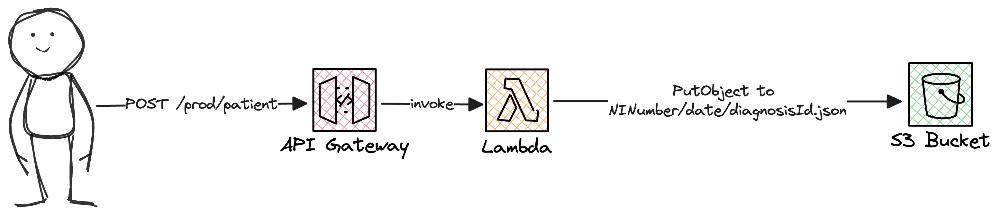

# Welcome To The Toptal CLS Workshop: "From Vulnerable To Secure"

During this 90 minute workshop you will be taking an existing client's unsecure serverless application and improving it's security posture using AWS best practices.

## The Project

The existing application is an API that allows GP practices to submit patient diagnoses.

The architecture looks something like this:

### Before You Start

This project uses the node.JS AWS CDK for deployments. The lambda function is written in Node.JS, however we will not be doing much coding, so don't worry if JS-languages are not your strength.

You will need the following before getting started with the workshop:
- **An AWS account sandbox**: The emptier, the better. For the purposes of this workshop it would be best to have access to an admin user for simplicity.
- **CDK bootstrapped**: You will need to [install and bootstrap your AWS account](https://docs.aws.amazon.com/cdk/v2/guide/getting_started.html). Complete up to and including step 7.
- **A method of making API calls**: My recommendation is [Postman](https://learning.postman.com/docs/getting-started/first-steps/overview/), this will allow you to use my examples directly.

### Getting Started

Let's deploy our application!

- **Ensure you are in the correct directory**: `cd cdk-lambda-s3-api-v2`
- **Deploy the application**: `cdk deploy`

After some minutes the deployment should have been a success and you can find your deployed S3 bucket, Lambda Function and API Gateway.

- **Deploy your API Gateway**: The API Gateway needs a manual deployment, this can be done from the `Deploy` button in the API Gateway console UI. Feel free to use the default `prod` stage.

The API will now be deployed and you have access to an unauthenticated URL you can now invoke

- **Seed your API**: You can now run some prepared API requests to simulate real users from the [Postman collection](https://learning.postman.com/docs/getting-started/importing-and-exporting/importing-data/) (init.postman_collection.json) at the root of this repo. 

Note you will need to update the URL to reflect your own API gateway deployment.

- **Congratulations!**: You have deployment and seeded your insecure API with initial data! Now it is time to secure it!
